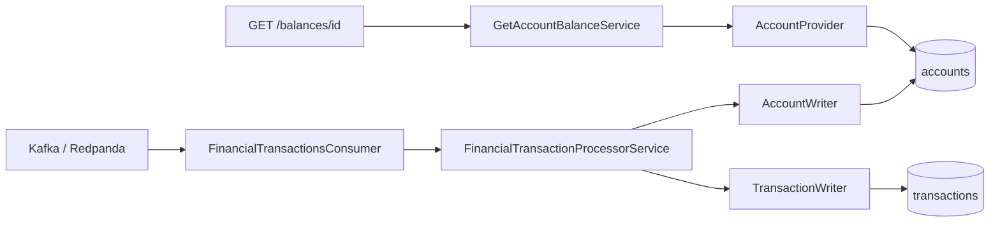

# Gerenciador de saldo

Serviço Kotlin/Spring Boot que recebe transações financeiras processadas pelo Kafka, persiste o saldo mais recente e o histórico no DynamoDB e expõe a consulta de saldo por HTTP.

## Stack

- Kotlin 2.3, Java 21 e Spring Boot 4.1
- Kafka/Redpanda
- DynamoDB (AWS SDK v2)
- Gradle, JUnit 5, Mockito, Konsist e JaCoCo

## Fluxo

1. O consumer lê eventos do tópico `transacoes-financeiras-processadas`.
2. O evento já contém o saldo consolidado; este serviço não recalcula crédito ou débito.
3. A conta é atualizada somente quando `updatedAt` é maior que a versão armazenada.
4. A transação é registrada com escrita condicional para ignorar reprocessamentos.
5. `GET /balances/{accountId}` faz leitura fortemente consistente da conta.



## Contrato Kafka

Exemplo de evento:

```json
{
  "transaction": {
    "id": "8e8ae808-b154-48b5-9f3e-553935cc4543",
    "type": "CREDIT",
    "amount": 97.07,
    "currency": "BRL",
    "status": "APPROVED",
    "timestamp": 1751641364589998
  },
  "account": {
    "id": "5b19c8b6-0cc4-4c72-a989-0c2ee15fa975",
    "owner": "315e3cfe-f4af-4cd2-b298-a449e614349a",
    "created_at": 1634874339000000,
    "status": "ENABLED",
    "balance": {
      "amount": 183.12,
      "currency": "BRL"
    }
  }
}
```

Campos de tempo são epoch em microssegundos.

## API

```http
GET /balances/5b19c8b6-0cc4-4c72-a989-0c2ee15fa975
```

Sucesso (`200`):

```json
{
  "id": "5b19c8b6-0cc4-4c72-a989-0c2ee15fa975",
  "owner": "315e3cfe-f4af-4cd2-b298-a449e614349a",
  "balance": {
    "currency": "BRL",
    "amount": 183.12
  },
  "updatedAt": "2025-07-04T13:22:44.589"
}
```

Conta inexistente retorna `404` com o código `not.found`. Erros inesperados retornam `500` com o código `server.error`.

## Idempotência e consistência

- `accounts`: `attribute_not_exists(id) OR updatedAt < :updatedAtMessage`. Eventos duplicados ou antigos não substituem o saldo atual.
- `transactions`: mantém `accountId` como partition key e `timestamp` como sort key.
- `transaction_idempotency`: usa `transactionId` como chave e TTL em `expiresAt`. A transação e o marcador são gravados atomicamente; reprocessamentos dentro da janela de TTL não criam uma nova entrada.
- A consulta de conta usa `consistentRead=true`.

As gravações de conta e transação são chamadas separadas. Portanto, elas não formam uma única transação atômica entre tabelas; em caso de falha parcial, o retry deve completar a transação enquanto a atualização repetida da conta é ignorada.

## Executar

Pré-requisito: Docker com Docker Compose. No Windows, execute os comandos `make` pelo WSL2.

```bash
make up
make logs
make stop
```

Serviços:

- API: http://localhost:8080
- DynamoDB Admin: http://localhost:8001
- Redpanda Console: http://localhost:8081

Para desenvolvimento pela IDE:

```bash
make db-up
make kafka-up
./gradlew bootRun
```

Variáveis:

| Variável | Padrão |
|-|-|
| `DYNAMODB_ENDPOINT` | `http://localhost:8000` |
| `DYNAMODB_REGION` | `us-east-1` |
| `DYNAMODB_ACCOUNT_TABLE_NAME` | `accounts` |
| `DYNAMODB_TRANSACTION_TABLE_NAME` | `transactions` |
| `DYNAMODB_TRANSACTION_IDEMPOTENCY_TABLE_NAME` | `transaction_idempotency` |
| `KAFKA_BOOTSTRAP_SERVERS` | `localhost:19092` |
| `KAFKA_CONSUMER_GROUP_ID` | `financial-transactions-consumer` |
| `FINANCIAL_TRANSACTIONS_TOPIC` | `transacoes-financeiras-processadas` |
| `TRANSACTION_IDEMPOTENCY_TTL_SECONDS` | `86400` (24 horas) |

As tabelas `accounts`, `transactions` e `transaction_idempotency` são criadas pela aplicação ou pelo seed do Compose. O seed configura o TTL `expiresAt`, insere uma conta e uma transação de exemplo e publica três eventos em `transacoes-financeiras-processadas`.

## Testes e cobertura

Os testes unitários não exigem Kafka nem DynamoDB reais:

```bash
./gradlew test
./gradlew check
```

`check` executa os testes, valida a arquitetura hexagonal e exige no mínimo **90% de cobertura de instruções**. O relatório fica em:

`build/reports/jacoco/test/html/index.html`

Para executar em Java 21 sem configurar uma JVM local:

```bash
docker build --target test .
```

Os cenários cobrem mapeamento e validação de eventos, orquestração dos casos de uso, contratos DynamoDB, idempotência, leitura consistente, erros HTTP e configuração das tabelas.

Os testes de integração usam DynamoDB Local e Redpanda reais. Eles validam persistência e leitura de saldo, rejeição de versões antigas, idempotência por `transactionId` e consumo/mapeamento do evento Kafka:

```bash
make integration-test
```

Também podem ser executados manualmente após subir a infraestrutura:

```bash
make db-up
make kafka-up
./gradlew integrationTest
```

## Estrutura

```text
src/main/kotlin/br/com/itau/challenge/balance/
├── domain/       modelos do negócio
├── port/         contratos de entrada e saída
├── application/  casos de uso
└── adapter/
    ├── input/    Kafka e HTTP
    └── output/   DynamoDB
```
